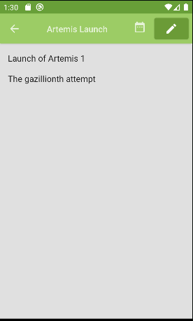
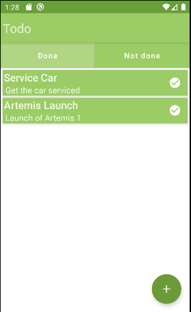
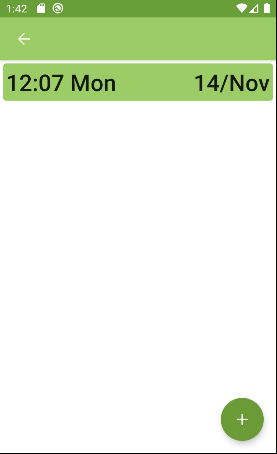

# Todo
Simple project to familiarise myself with Android.

----

Simple todo app that lets you create todo apps with a title and simple description, as well as adding and mananing reminders for the individual todos, launching notifications at the set reminder date and time.

App is built with a simple MVVM architecture with the UI view layer built with  
Compose. The view model layer interacts with Android notification and alarm systems via a notifications service, using intents and receivers. The data layer uses a simple room database to store todos and reminders, is also used to restore lost notifications on boot.

## Libraries Used
-----

- [Kotlin Coroutines](https://github.com/Kotlin/kotlinx.coroutines) for asynchronous programming and testing
- [Room](https://developer.android.com/reference/androidx/room/package-summary) for local storage
- [Compose](https://github.com/JetBrains/compose-jb) for views
- [Dagger-Hilt](https://dagger.dev/hilt/) for dependency injection
- [Mockito Kotlin](https://github.com/mockito/mockito-kotlin) for mocking in tests
- [Espresso](https://developer.android.com/training/testing/espresso) for UI tests
- [Junit4](https://github.com/junit-team/junit4) as general testing framework

## Images
------

  
   
  

[room_link]: "https://developer.android.com/reference/androidx/room/package-summary"

### Planned

- Rework notification system to let you set weekly reminders instead of one-shot alarms
- Redo the UI for a slightly less garish look
- Improve app architecture